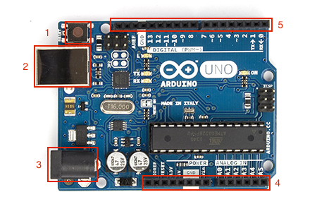
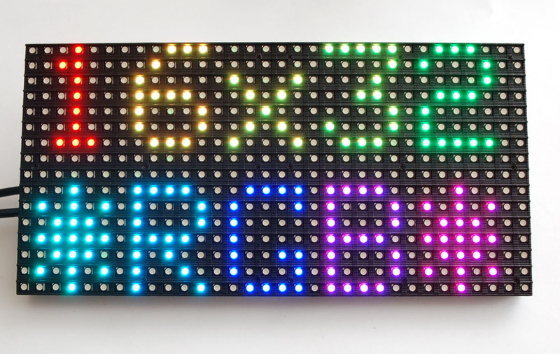
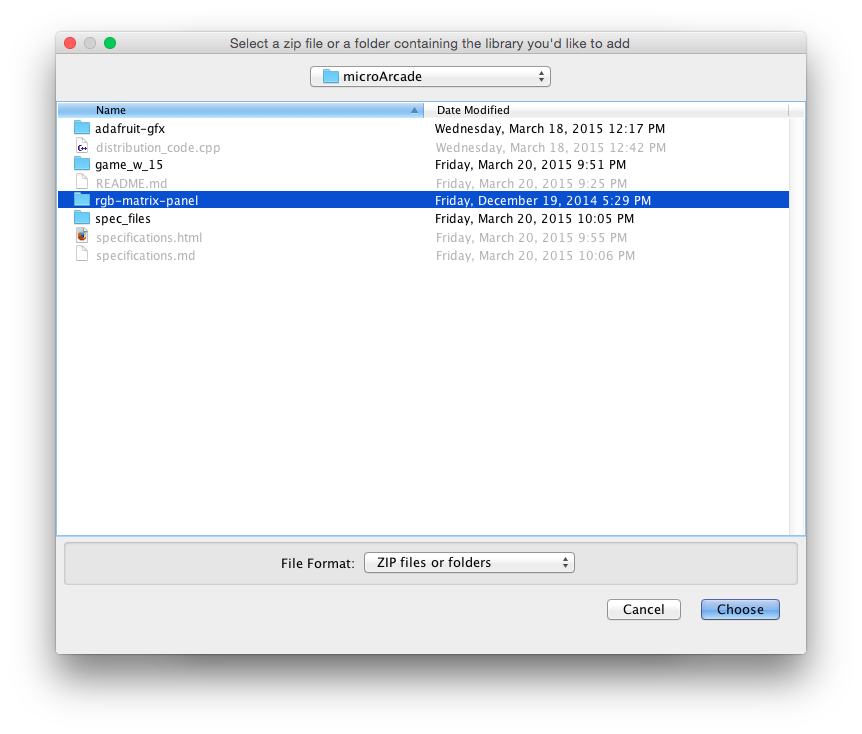
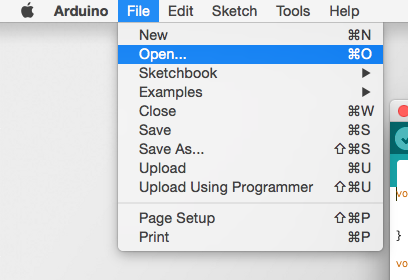

# Arduino Micro Arcade

This project involves using the Arduino micro-controller link two sensors to an LED screen, so that you can play [Space Invaders](http://en.wikipedia.org/wiki/Space_Invaders). The goal of this project is for you to:

* Gain experience working with hardware, including circuits and a little bit of soldering (yes, there will be soldering!)
* Understand the basics of how software can control hardware, both input (a potentiometer and a button) and output (an LED screen)
* Solidify the concepts you've learned in EECS 183, including functions, branches, loops, arrays, and classes
* Use these concepts in a comprehensive project
* Start moving beyond simply writing code to designing programs
* Have fun!

Here's a picture of what your final product might look like:

## Table of Contents

* [Core](#core)
    * [Hardware Overview](#hardware-overview)
        * [The Arduino](#the-arduino)
        * [The Breadboard](#the-breadboard)
        * [The Inputs](#the-inputs)
        * [The Output](#the-output)
    * [Software Overview](#software-overview)
        * [Space Invaders](#space-invaders)
        * [Graphics](#graphics)
        * [Game Dynamics](#game-dynamics)
* [Getting Started](#getting-started)
    * [Hardware](#hardware)
    * [Software](#software)
    * [Distribution Code](#distribution-code)
* [Hints](#hints)
* [Reach](#reach)
* [Proposal](#proposal)
* [Submission](#submission)
* [Troubleshooting](#troubleshooting)
* [References](#references)

# Core

The core part of this project is for you to implement a clone of Space Invaders, an early arcade game and a key part of video game history. We chose this game so that it is approachable for beginning programmers and game developers while fitting the micro Arcade platform well.

## Hardware Overview

**NOTE**: At the end of the showcase, you **MUST** return all components that you have checked out from the class. **_If any component is broken, or if it is not returned at the end of the showcase, you must pay to replace that component._**

Your team will be provided with the following necessary hardware

* Arduino Uno
* Adafruit 16x32 RGB Matrix Panel
* 1 potentiometer
* 1 button
* 1 flat ribbon cable
* 1 USB cable
* 5V power converter
* wires
* resistors

### The Arduino

The Arduino is a single-board microcontroller, essentially a tiny computing platform for creating interactive projects. The Arduino language is based on C/C++ and is very easy to learn. Libraries are available for all types of displays you will use, and I/O in general is easy to program. Arduino uses its own IDE, and you are expected to use it. You can download it at [the Arduino website](http://arduino.cc/en/Main/Software).

If you orient your Arduino to match the picture above, you can see the main components of the Arduino you will be using. Going counter-clockwise from the top left:

1. On the top left corner, there's a button that restarts the Arduino.
2. Just below that button is a USB port, that allows you to upload code to the Arduino.
3. On the bottom left corner, there's 5V power connector. You won't need to use this, as we will be powering the Arduino by USB.
4. Along the lower edge are a series of *pins*, which connect the Arduino to inputs and outputs. If you look closely, you will see that some pins provide power, while others get *analog* input (like the potentiometer) and output (like telling the LED screen which rows to light up)
5. Along the upper edge, there's another series of pins. These handle *digital* input (like the button) and output (like the color of the LEDs).

### The Breadboard

The way you will connect the Arduino to its inputs and outputs with through a *breadboard*. They look like this:

Breadboards let you create circuits by providing an easy way to wire things together. Inside the breadboard, there's a piece of metal that connects every numbered row, so all wires plugged into that row would share the same voltage/signal. Additionally, the column of holes on the side also share a connection. The colored lines indicate that these holes are usually used for power and ground (red for power, blue for ground) - any electronic circuit needs to have some connection between power and ground to work. In the picture above, all the holes inside a purple rectangle share a connection. For this project, we will mostly be using the power and ground holes on the breadboard.

### The Inputs

More information to come soon!
<!-- FIXME -->

### The Output

We are using the Adafruit 32x16 LED screen. The front of it looks like this (when it's lit up):

Each of those little white dots is an LED (Light Emitting Diode). We can separately set the amount of red, green, and blue light that comes out of it; when they're all on, the LED will be white, while if they're all off the entire LED will be off.

On the back, there are three main connectors. Make sure the board says "IN" or "INPUT" and "OUT" or "OUTPUT" near the correct connectors:

* On the left is the input connector. We will be connecting this to the Arduino via the breadboard, some wires, and a flat ribbon cable.
* In the middle is the power connector. We will be connecting this to the power converter.
* On the right is the output connector. We will not be using this connector in this project.

## Software Overview

Your team will be provided with the following necessary software:

* A starter sketch file including the minimal set of functions necessary for the Core project.
* Two libraries for using the LED screen.

Additionally, you will need to install:

* The Arduino IDE

### Space Invaders

The goal of this game is to kill all invaders by shooting them, before they can move past you or kill you in turn. You will control a cannon through a potentiometer and a button; the potentiometer controls where you cannon points, while the button fires the cannon.

Every game begins the same way:

1. Before the game starts, display "Lives: `<number of lives>`".
2. Before a level starts, display "Level: `<level number>`".
3. The invaders are then *array*-ed on the top of the screen; the game begins.
    * If an invader's strength is reduced to 0, it dies and disappears from the screen.
    * If an invader touches the player's cannon, the player dies (and loses a life).
    * If an invader reaches the bottom of the board, the player loses a life.
    * If all invaders are killed, the next level is loaded.
4. The game continues until the player has died three times, or until the player has beaten all the levels.

The initial layout and the strength of the invaders depends on the level. All levels have at most 16 invaders, laid out in two rows of 8.

* On Level 1, only 8 invaders are present on the top of row, all with strength 1:

        1 1 1 1 1 1 1 1

* On Level 2, 16 invaders are present in two rows, with strengths specified as follows:

        1 2 1 2 1 2 1 2
        2 1 2 1 2 1 2 1

* On Level 3, 16 invaders are present in two rows, with strengths specified as follows:

        1 2 3 4 5 1 2 3
        4 5 1 2 3 4 5 1

* On Level 4, 16 invaders are present in two rows, with strengths specified as follows:

        5 4 5 4 5 4 5 4
        2 3 2 3 2 3 2 3

* On Level 5 and after, the 16 invaders will have randomly chosen strengths.

### Graphics

The player's cannon is drawn as four LEDs, 3 on the bottom and one on top in the middle. The player is always aquamarine in color.

     *
    ***

The invaders are drawn with 12 LEDs each:

     ## 
    #**#
    ####
    #  #

The LEDs marked with # change in color depending on the strength of the invader, while the LEDs marked with * are always blue. The invaders are colored roughly according to a rainbow:

* Strength 1: red
* Strength 2: orange
* Strength 3: yellow
* Strength 4: green
* Strength 5: blue
* Strength 6: purple
* Strength 7: white

Finally, the cannonball fired by the player takes two LEDs, vertically on top of each other. It is always orange.

    *
    *

### Game Dynamics

The player is controlled by the potentiometer, and when the button is pressed, a cannonball should shoot out from the top middle LED. The cannon should be able to shoot from any column of the board; this means that the base of your cannon should be able to move one pixel off the edge of the screen, with the barrel appearing on the edge. When you shoot, the shot should be visible until you reach a creature or until it moves off of the top of the board. Both the cannonball and the invader should disappear on the iteration in which the ball would move on top of the invader.

The invaders should move down by one LED every 50 iterations of your "Loop()" function until they reach the bottom of the board or disappear. In one iteration of "Loop()", you should first get the new position of the paddle based on potentiometer values. Then, every 50th iteration, move the bottom most row of invaders down one pixel. After the invaders have been updated, either check to see if you need to update the ball, or, if there is not a ball on the board, check to see if the player is pressing a button to shoot a new ball.

# Getting Started

## Hardware

**WARNING: DO NOT power your Arduino or LED Matrix unless you are sure everything is wired properly**. Improperly wired projects may cause damage to your board or components. **_If you break a component, you will be responsible for replacing it!_**

More information to come soon!
<!-- FIXME -->

## Software

**WARNING: DO NOT start coding until you have wired your matrix properly and can test, while you code.**

1. Download the distribution code from Github, but issuing this command on the terminal

    git clone <YOUR_GITHUB_URL_HERE>

2. [Download the Arduino IDE](http://arduino.cc/en/Main/Software). Although there are Xcode and Visual Studio plugins for Arduino, the staff will **not** support them.

3. Install and/or run the Arduino IDE. Follow any directions as necessary; in particular, on Macs, you may be asked to install a newer version of Java. Successfully starting the IDE should give you a window like this:

    

4. Make sure that from the menubar, Tools > Board > Arduino Uno is selcted.

    

5. Make sure that from the menubar, Tools > Port > Arduino Uno is selcted.

    

6. From the menubar, click Sketch > Import Library > Add Library:

    

7. In the dialog, select the Adafruit GFX library (the adafruit-gfx directory in your Git directory).

    

8. Repeat steps 4 and 5 with the RGB Matrix Panel library (the rgb-master-panel directory in your Git directory)

    

9. Open the distribution code from the menu, or alternately, from the Open button (the up-arrow) near the top of the IDE.

    
    

10. Click the Verify button (the checkmark) near the top of the Arduino IDE. This compiles your code and checks for errors. If you get an "Error Compiling" message, make sure you have added the libraries correct (steps 4-6). A successful compilation looks like this:

    

11. Congratulations! You are now ready to start programming your Arduino! Start by playing with the Arduino by looking at the examples under the `rgb-matrix-panel` directory. When you get a feel for how the functions work, it's time to start thinking about how you would write your Space Invader clone.

## Distribution Code

All the code that you write for this project will be in the single distribution file. This includes not only the code for drawing the invaders and the player cannon, but also the code that determines whether the player has won or lost.

The Arduino, Adafruit GFX, and RGB Matrix Panel libraries provide several functions you may use. Some functions you may find useful include:

* `delay(int t)` stops the execution of your program for `t` milliseconds.
* `millis()` returns the number of milliseconds since your program started.
* `pinMode(int pin, MODE)` sets the argument `pin` to take digital input - like a button. For this project, `MODE` should always be `INPUT`.
* `digitalRead(int pin)` takes a `pin` (like the one passed to `pinMode()`) and returns either `HIGH` or `LOW`. For a button, this corresponds to the button being pressed and not being pressed respectively.
* `analogRead(int pin)` reads the value of the argument `pin` and returns its value. This is used for analog inputs - like the potentiometer.

These functions, and many others, are all documented [on the Arduino website](http://arduino.cc/en/Reference/HomePage).

In addition to Arduino functions, the Adafruit screen also has functions you can use. We have defined a global variable called `matrix`, which is how you control the LED screen. It has several member functions:

* `begin()` initializes the screen
* `Color333(int r, int g, int b)` returns a `COLOR` where the `int` arguments are the red, green, and blue aspects of a color in [the RGB model](http://en.wikipedia.org/wiki/RGB_color_model) In this case, the arguments `r`, `g`, and `b` must be between 0 and 7 inclusive.
* `drawPixel(int x, int y, COLOR)` turns the pixel at (x, y) into the specified color. Since the screen is 32 LEDs wide by 16 LEDs high, this function requires `0 <= x < 32` and `0 <= y < 16`. If `COLOR` is black (ie. `r == g == b == 0`), then the LED is turned off.
* `fillScreen(COLOR)` turns every pixel of the screen to the specified `COLOR`.
* `print(char c)` switches the LEDs on screen to display the character `c`. The effects of this function is modified by several other functions; see below.
* `setCursor(int x, int y)` moves the "cursor" of the screen to the (x, y) location. This changes the effect of `print()`.
* `setTextColor(COLOR)` sets the color of printed text to `COLOR`. This changes the effect of `print()`.
* `setTextSize(int size)` sets the size printed text. A `size` of 1 means the text will be 8 LEDs tall. This changes the effect of `print()`.

For everywhere that we used `COLOR` above, we refer to the output of the function `Color333()`. You can learn more about the Adafruit libraries by looking at the `.h` files included with the distribution code.

For convenience, we have outlined several classes for you. *You are not required to use these classes*, but they may help you get started.

* The `Color` class (not to be confused with `COLOR` above) is a wrapper around  `Color333()`, so you don't have to deal with RGB values directly. Several `const Color`s have already been defined for you, although of course you are welcome to define more colors. To use in the `matrix` functions, use `Color::to_333()`, eg. `matrix.drawPixel(1, 1, GREEN.to_333());`.
* The `Invader` class represents an invader.
* The `Cannonball` class represents the cannonball.
* The `Player` class represents the player cannon.
* The `Game` class pulls everything together, and handles the logic of winning and losing, as well as the drawing of each game element.

Finally, you can use the `Serial.print(string text)`  and `Serial.println(string test)` functions for debugging. This prints `text` to the Arduino IDE, much like ``cout`` prints to the console in Xcode or Visual Studios. `Serial.print()` does not insert an `endl`, while `Serial.println()` does. Be careful! If you use either function too many times in your code, your code could slow to a crawl.

# Reach

From the basic use of the Arduino microcontroller, there are many extensions for this project. Here is a short list meant to inspire your team. The list of possible extensions to this project is limited only by your imagination:

* Adding sound to your games and an LCD display for a scoreboard would be nice and is something you should look into, but this would not be a complete extension considering how simple it is. You would have to couple it with a few more ideas. 
* Program an additional game (ex. snake, pong, block breaker). This is our favorite reach possibility!
* Change the rules of the current game so that it has a more difficult implementation. Here are examples of some things you can add:
* The player could have points that he accumulates based on how fast he finishes each level. Point value can be displayed right before the game ends.
    * As a round progresses, the speed of the invaders could increase with each kill.
    * You could add another cannon to the board.
    * You could make the cannon size grow or shrink as the player plays the game and have extra shots.

# Proposal

## Step 1 of 2

Submit your proposals in PDF format by **Fri 3/27** to [the autograder](https://umich.edu/~eecs183/autograder) under the appropriate Proposal submission section. Please include the names of all your team members in your Proposal document. Your submission should be titled 

        arduino_uniqname1_uniqname2_uniqname3_uniqname4.pdf

The team that you submit your proposal with constitutes your team for the Final Project. There will be no revisions to these teams except in situations which merit staff intervention. You may not change your team once this document has been submitted.

Your proposal **must** also answer the following questions about your team:

* How will your team split up the work?
* How regularly will your team meet to work on this project, if at all?
* What are two possible ideas for the reach that you are considering?

As well as these warm-up questions about the project:

* In the [Distribution Code Overview](#distribution-code-overview), we mention that `matrix` has member functions. How would you call the `fillScreen()` function of `matrix`?
* The LED screen starts with (0, 0) at the top left corner, and has 16 rows and 32 columns. What is the (x, y) of the bottom right corner? How would you [turn that pixel `RED`](#distribution-code)?
* There are at most 16 `Invaders` on screen. What is a good way of storing these Invaders? What programming concept could you use to draw all of them?

## Step 2 of 2

Head to https://umich.edu/~eecs183/forms/final_project where a form awaits. Fill it out by **Fri 3/27**. Once **each member of your team** has submitted that form (and your team has submitted the PDF in Step 1), you are done with the Proposal! We advise you submit these while meeting with your teammates, if possible, to minimize the chances of misspelling any uniqnames or your team name.

# Submission

Submissions will occur via your team GitHub repository. You will create a sketch file starting from the distribution code. Your entire implementation will be in this one file. We will retrieve your file from your group repository on the due date.

# Troubleshooting

If the Arduino IDE refuses to run on a Mac, even after you have installed a newer version of Java, you may need to download the experimental version. Go back to [the Arduino website](http://arduino.cc/en/Main/Software), download the experimental version (the one marked "for Java 7+"), and try again. If this still doesn't work, come talk to one of us.

# References

* The [Adafruit GFX library](https://github.com/adafruit/Adafruit-GFX-Library/commit/a9e5bc470736ffe9c9ef11d778bc4dcd47169d42)
* The [Adafruit RGB Matrix Panel library](https://github.com/adafruit/RGB-matrix-Panel/commit/8570b7a431ff0ac52ff16b8448926cd0913dd609)
